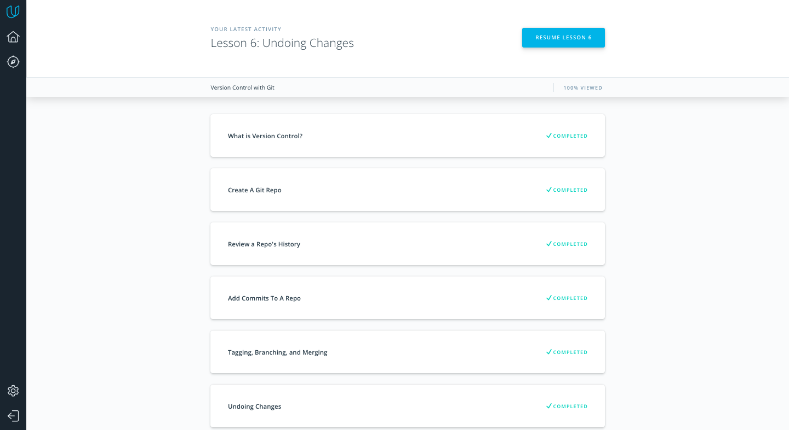
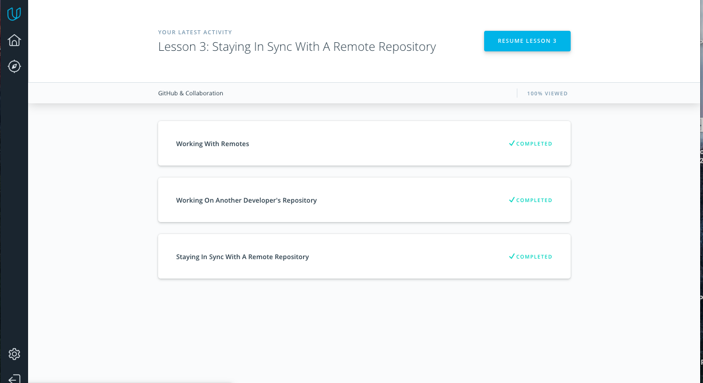

# kottans-frontend :mortar_board:

_Welcome to my reflections about Stage 0 of Front-End course by Kottans._

 - [x] [Git and GitHub Intro](https://github.com/kottans/frontend/blob/master/tasks/git-intro.md)
 - [x] [Linux, Command Line, HTTP Tools](https://github.com/kottans/frontend/blob/master/tasks/linux-cli-http.md)
 - [x] [Git for Team Collaboration](https://github.com/kottans/frontend/blob/master/tasks/git-collaboration.md)
 - [ ] [Intro to HTML and CSS](https://github.com/kottans/frontend/blob/master/tasks/html-css-intro.md)

Git and GitHub
=======

The course was amazing! I’ve systematized my existing knowledge and learned a few new things, such as cherry-pick,  creating PR and solving the conflicts if they occur. Also I’ve finally understood git flow process. Now i feel much more comfortable with Git and GitHub.  

Linux, Command Line, HTTP Tools
=======

Codecademy course about CLI was extremely useful for we.  I have learnt a lot of new commands ( for example,  redirection commands ) Also i’ve learnt how to configure the environment in bash profile using nano editor. And I would definitely use them im my daily routine. 

Speaking about 2 articles about HTTP: it was new for me to learn about connection handling,  authentication and caching. Also i didn’t know about the tool called Chrome/Webkit inspector.  I would definitely use it in the future. I hope i will deepen my knowledge while having a real practise with HTTP and learning more about it. 

Git for Team Collaboration
=======

###### 1. [What is Version Control](https://classroom.udacity.com/courses/ud123/)

I wish it was my first course about git, so understandable and intelligible! 
Although there was a lot of things known to me, there was something new for me:

* how to navigate the log
* commands  git log --oneline git log --stat used to  alter how git log displays information
* git tagging responsible for the version of the project
* git commit --amend - to change the most recent commit
* git revert SHA-of-commit-to-revert - reverse given commit
* git reset reference-to-commit - to delete the commit 

I would use all of it in my future projects.

###### 1. [GitHub & Collaboration](https://classroom.udacity.com/courses/ud456)

Another greact course about GitHub. New for me in it:

* difference between git fetch and git pull:  git pull only downloads new data from a remote repository -  it doesn't integrate any of this new data into the local branch. Git pull in not only downloads new data, it also directly merges it into your current local branch. You should not have any uncommitted local changes before you pull. You have to push before you pull. If you don’t want to do it you can use fetch. 
* difference between fork and clone: with fork a new duplicate copy of the remote repository is created. With clone the remote stays the same.
* $ git shortlog -  to see how many commits each contributor has added to the repository
* i’ve learnt about GitHub Issues
* squashing commits (taking their numbers and combining them in one single commit for cleaner git log). $ git rebase -i HEAD~3 - will combine last 3 commits.