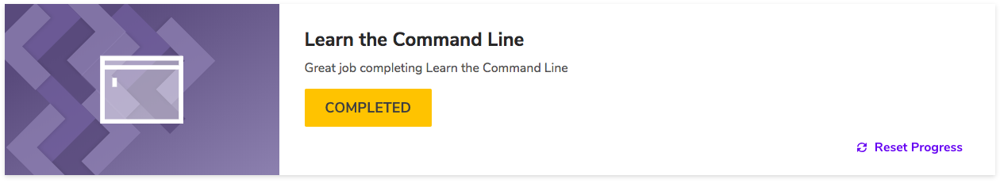

# kottans-frontend :octocat: :mortar_board:

Welcome to my reflections about Stage 0 of Front-End course by Kottans.

 - [x] [ Git and GitHub Intro] (https://github.com/kottans/frontend/blob/master/tasks/git-intro.md)
 - [x] [ Linux, Command Line, HTTP Tools] (https://github.com/kottans/frontend/blob/master/tasks/linux-cli-http.md)
 - [x] [ Git for Team Collaboration] (https://github.com/kottans/frontend/blob/master/tasks/git-collaboration.md)
 - [ ] [ Intro to HTML and CSS] (https://github.com/kottans/frontend/blob/master/tasks/html-css-intro.md)

Git and GitHub
=======

The course was amazing! I’ve systematized my existing knowledge and learned a few new things, such as cherry-pick,  creating PR and solving the conflicts if they occur. Also I’ve finally understood git flow process. Now i feel much more comfortable with Git and GitHub.  

Linux, Command Line, HTTP Tools
=======

Codecademy course about CLI was extremely useful for we.  I have learnt a lot of new commands ( for example,  redirection commands ) Also i’ve learnt how to configure the environment in bash profile using nano editor. And I would definitely use them im my daily routine. 

Speaking about 2 articles about HTTP: it was new for me to learn about connection handling,  authentication and caching. Also i didn’t know about the tool called Chrome/Webkit inspector.  I would definitely use it in the future. I hope i will deepen my knowledge while having a real practise with HTTP and learning more about it. 

Git for Team Collaboration
=======